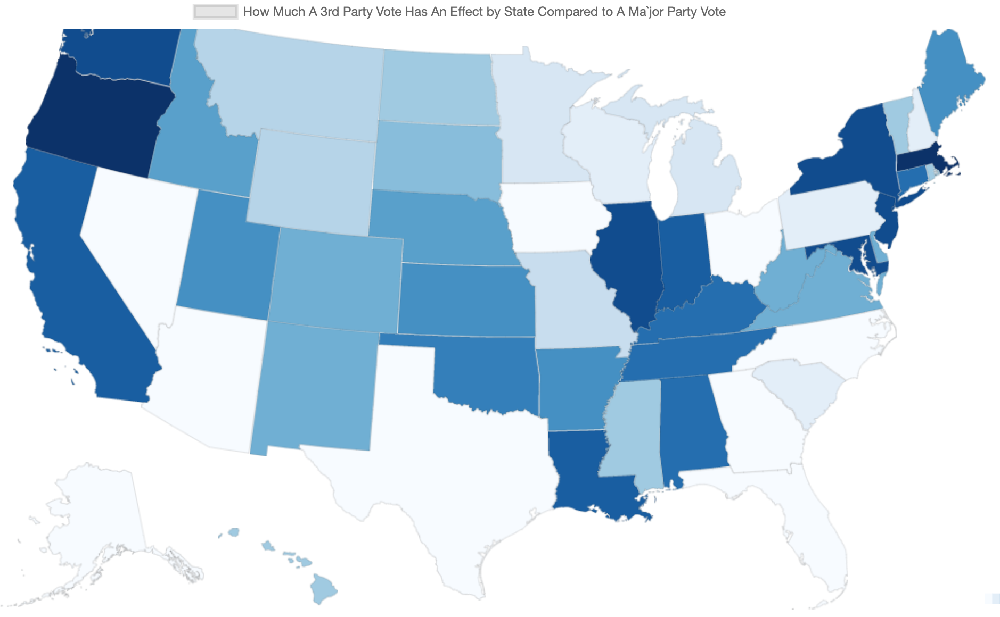

## Third Party 5% Threshold

Many say that a third party vote is impractical because a third party has no chance of winning the presidential election.

However, this doesn't take into account the **5% popular vote threshold**. If a third party gets 5% of the popular vote, that third party becomes a minor party.

Minor parties receive government matching funds. This would throw a wrench into the two major parties for the next election. We would now have a three party system. This would increase competition amongst the parties leading to higher innovation and accountability.

This chart shows the effect your vote has on the third party threshold if you vote third party vs the effect your vote has on the presidential outcome if you vote for a major party.

The results showed that in **_every state a 3rd party vote had a greater effect_** compared to a major party vote. This map shows how much more of an effect.

The math is [here](https://docs.google.com/spreadsheets/d/1dkdP6XKCyUQYSHoqEduG3TvNgM2E2eSzxIs5VjKxFuc/edit?usp=sharing). Please fork the repo and copy the spreadsheet if you'd like to recalculate the numbers.

## Click here to see the _interactive_ [Third Party 5% Threshold Map](https://dashbarkhuss.github.io/third_party_threshold/)

_(Works best on **desktop**)_

## Results Highest to Lowest

In every state, 1 vote has a greater effect on the 5% third party threshold than it does on the presidential outcome. The degree of this effect varies by state. In the most extreme, a Massachusetts 3rd party vote is 1194 times more powerful than a major party vote. In the least extreme, a Georgia 3rd party vote is 21 times more powerful a major party vote.

**Still, it can be argued that voting 3rd party is more statistically practical in any state than voting for a major party** in the case that one values breaking up the current two party system.

| State                | How many times greater your vote counts if you vote 3rd party than if you vote for a major party. |
| -------------------- | ------------------------------------------------------------------------------------------------- |
| Massachusetts        | 1194                                                                                              |
| Oregon               | 1129                                                                                              |
| Illinois             | 1104                                                                                              |
| Maryland             | 1098                                                                                              |
| New Jersey           | 1093                                                                                              |
| Washington           | 1091                                                                                              |
| New York             | 1051                                                                                              |
| California           | 1018                                                                                              |
| Louisiana            | 1002                                                                                              |
| Indiana              | 982                                                                                               |
| Kentucky             | 950                                                                                               |
| Alabama              | 932                                                                                               |
| Connecticut          | 928                                                                                               |
| Tennessee            | 900                                                                                               |
| Oklahoma             | 820                                                                                               |
| Kansas               | 779                                                                                               |
| Utah                 | 745                                                                                               |
| Arkansas             | 744                                                                                               |
| Maine                | 738                                                                                               |
| Idaho                | 681                                                                                               |
| Nebraska             | 667                                                                                               |
| New Mexico           | 630                                                                                               |
| Colorado             | 610                                                                                               |
| Virginia             | 605                                                                                               |
| Delaware             | 584                                                                                               |
| West Virginia        | 564                                                                                               |
| South Dakota         | 487                                                                                               |
| Rhode Island         | 458                                                                                               |
| North Dakota         | 453                                                                                               |
| Hawaii               | 423                                                                                               |
| Vermont              | 415                                                                                               |
| District of Columbia | 410                                                                                               |
| Mississippi          | 398                                                                                               |
| Wyoming              | 337                                                                                               |
| Montana              | 327                                                                                               |
| Missouri             | 277                                                                                               |
| Minnesota            | 233                                                                                               |
| Michigan             | 169                                                                                               |
| Wisconsin            | 131                                                                                               |
| Pennsylvania         | 111                                                                                               |
| New Hampshire        | 105                                                                                               |
| South Carolina       | 103                                                                                               |
| Nevada               | 62                                                                                                |
| Florida              | 53                                                                                                |
| Alaska               | 38                                                                                                |
| North Carolina       | 38                                                                                                |
| Texas                | 33                                                                                                |
| Arizona              | 29                                                                                                |
| Ohio                 | 27                                                                                                |
| Iowa                 | 25                                                                                                |
| Georgia              | 21                                                                                                |

## Results Alphabetical

| State                | How many times greater your vote counts if you vote 3rd party than if you vote for a major party. |
| -------------------- | ------------------------------------------------------------------------------------------------- |
| Alabama              | 932                                                                                               |
| Alaska               | 38                                                                                                |
| Arizona              | 29                                                                                                |
| Arkansas             | 744                                                                                               |
| California           | 1018                                                                                              |
| Colorado             | 610                                                                                               |
| Connecticut          | 928                                                                                               |
| Delaware             | 584                                                                                               |
| District of Columbia | 410                                                                                               |
| Florida              | 53                                                                                                |
| Georgia              | 21                                                                                                |
| Hawaii               | 423                                                                                               |
| Idaho                | 681                                                                                               |
| Illinois             | 1104                                                                                              |
| Indiana              | 982                                                                                               |
| Iowa                 | 25                                                                                                |
| Kansas               | 779                                                                                               |
| Kentucky             | 950                                                                                               |
| Louisiana            | 1002                                                                                              |
| Maine                | 738                                                                                               |
| Maryland             | 1098                                                                                              |
| Massachusetts        | 1194                                                                                              |
| Michigan             | 169                                                                                               |
| Minnesota            | 233                                                                                               |
| Mississippi          | 398                                                                                               |
| Missouri             | 277                                                                                               |
| Montana              | 327                                                                                               |
| Nebraska             | 667                                                                                               |
| Nevada               | 62                                                                                                |
| New Hampshire        | 105                                                                                               |
| New Jersey           | 1093                                                                                              |
| New Mexico           | 630                                                                                               |
| New York             | 1051                                                                                              |
| North Carolina       | 38                                                                                                |
| North Dakota         | 453                                                                                               |
| Ohio                 | 27                                                                                                |
| Oklahoma             | 820                                                                                               |
| Oregon               | 1129                                                                                              |
| Pennsylvania         | 111                                                                                               |
| Rhode Island         | 458                                                                                               |
| South Carolina       | 103                                                                                               |
| South Dakota         | 487                                                                                               |
| Tennessee            | 900                                                                                               |
| Texas                | 33                                                                                                |
| Utah                 | 745                                                                                               |
| Vermont              | 415                                                                                               |
| Virginia             | 605                                                                                               |
| Washington           | 1091                                                                                              |
| West Virginia        | 564                                                                                               |
| Wisconsin            | 131                                                                                               |
| Wyoming              | 337                                                                                               |
